# My Web App Journey: From Zero to ???

## Introduction

**Purpose:** This web app is a combination of two important features. Firstly, I am an avid Ultimate Frisbee player, so being able to log my workout would keep me accountable as a player. Secondly, as parents grew older they are required to log their blood pressure (bp) and blood glucose level, so I thought to create a web app so that they can log the details and be able to see a visual representation of their levels.

**Background:** I started off in University as a Mechanical Engineering student. Had "Introduction to Programming" where I learnt basic data structure and algorithms in C++. Upon graduating, I did not pursue engineering profession and instead, got into teaching. Meanwhile, I was also a part time online tutor - teaching scratch and python to kids and teens, this is where my passion for programming grew. I am intrigued in the endless posibilities to build apps and tools.

## Getting Started

**Initial Challenges:** I have always been intimidated by the vastness of programming. With countless languages and each with their own syntax and rules, it had always been a huge obstacle for me, perhaps was stuck deeply with decision paralysis.

**Resources and Tools:**

- My friend Jian Shen, for pointing me into the right directions and resources to kick start my project, as well as providing me insights and encouragement to finish my project.
- FastAPI tutorial documentation
- Windows Subsystem for Linux to be able to code in Linux environmnet
- Visual Studio Code as my main IDE for this project
- PrimeAgent "Last Data Structure and Algorithms Course" to understand more about DSA
- Google Data Analysis Course for SQL

## Learning the Tools

**Programming Languages:** I have learnt some Data Structures and Algorithms back in Uni days with C#, thus it was easier to take up some of the programming logics.

I currently teach Python to teens, so that has helped me to be able to build my backend using python. That being said, knowing basic Python syntax is just the tip of the iceberg for me, as there are still so much more that I learn while building my project.

For the frontend components HTML, CSS and JS primarily via youtube tutorials, documentations and then using AI to help me improve and understand my code better. Finally, I did also learn SQL early on in my teaching career as well as taking up the Google Data Analysis Certificate course which definitely helped my understanding of databases.

**Frameworks and Libraries:** To build my web app, I mainly used vanilla HTML, CSS and JavaScript for frontend, Python and FastAPI for backend and SQLite as my database.

As for FastAPI framework, getting familiar with the tutorial documentation was very helpful. In FastAPI, I first learnt how to create different endpoints for my backend.

Using the CRUD method, I was able to learn and apply the Get, Post, Put, and Delete method. As for JavaScript, I meddled with ChartJs to create interesting visuals for my dashboard.

**Version Control:** My experience with Git was a memorable one. After deploying my web app on Render, I played around my code, trying to add a user feature as an update - all this in the master branch. After a few commits, my app broke and I have no idea where the code base started to break. Thankfully, through Git I was able to revert my code base back to when my app still works. Now, I will always remember to test out features in a feature branch.

Using Git and GitHub was also interesting as branching allows me to see the changes that I made and compare my code with the previous or master branch before merging.

## Building the Web App

**Project Planning:** To start off the project, my planning mainly involved CRUD operations. I wanted an app that can serve two purposes, log workouts and health readings (blood pressure and glucose level) as well as diplaying the logs in a dashboard.
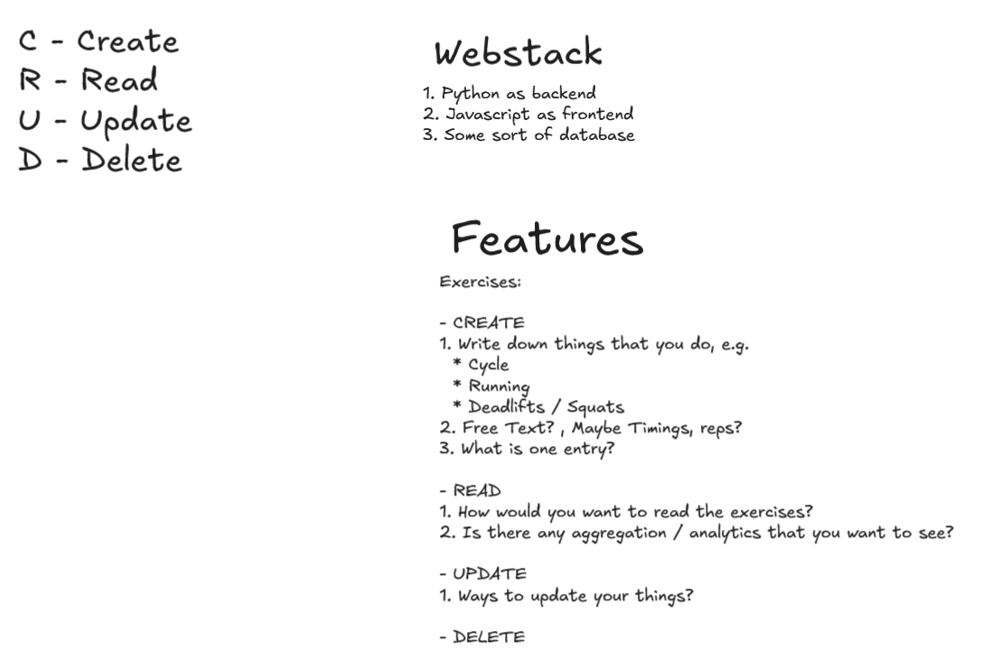

For the web app architecture, I used python FastAPI as backend, vanilla HTML, CSS and JavaScript as frontend and a JSON file as my database. This enabled me to focus on programming principles instead of relying on frameworks to work on my web app.

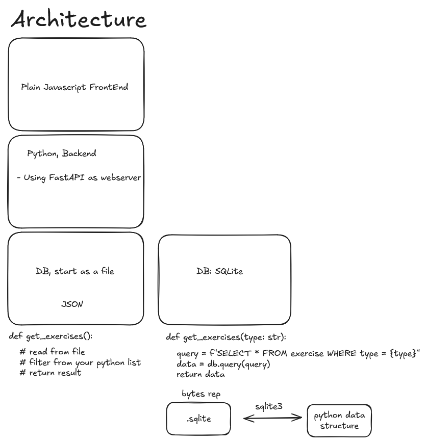

All the key features that I planned to add at that time was done with CRUD in mind. Through researching available dashboards online, I decided to create a UI that suits my style.

Here are some of the dashboard designs that caught my attention:

1. Fitness tracker app
   
2. Diving app
   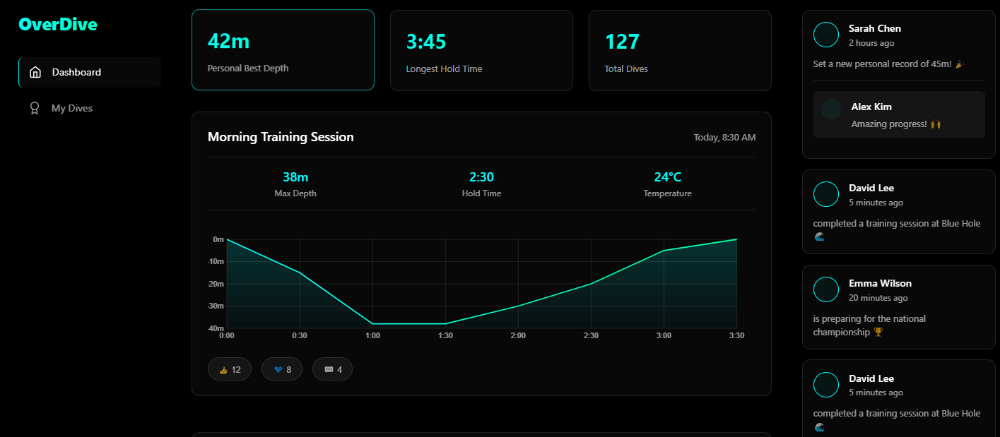

In the first week of my project, I planned on some of the key features I plan to add in my web app, this is done through wireframing and experimenting with different UIs. Most of my planning was done in Excalidraw as I could easily brainstorm and collaborate ideas.

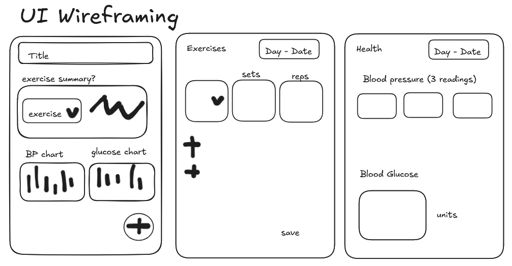
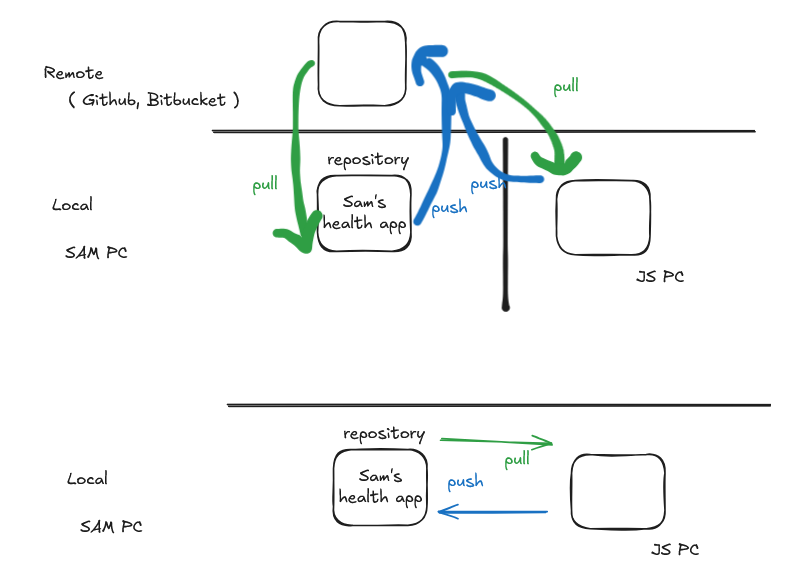

Finally,

**Development Process:** The development process was an interesting one, being able to implement code was both scary and exciting at the same time. It was done is several phases:

_Phase 1: Creating a Barebone HTTP server_

- Implemented backend using FastAPI with JSON file as my database.
- Created and tested endpoints using OpenAPI's Swagger documentation.
  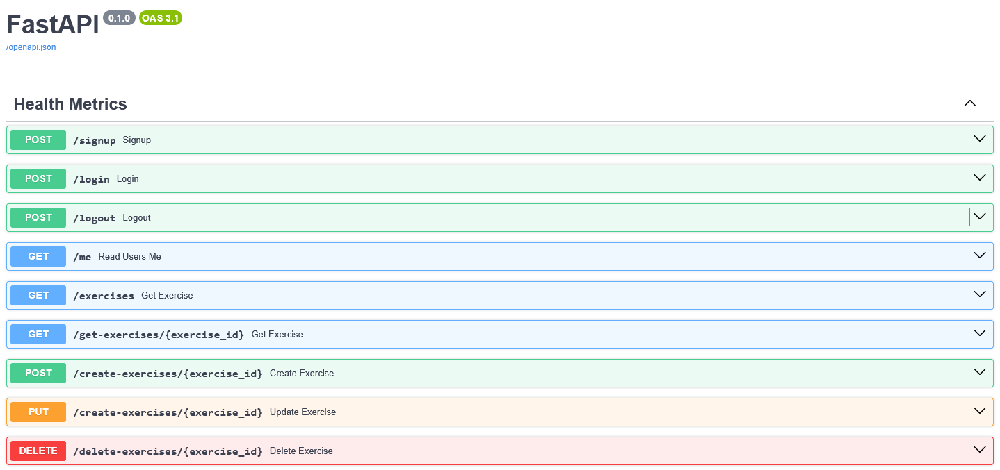

- Developed simple UI with vanilla HTML and CSS and using HTMLResponse to serve pages.
- Connected my client-server with JavaScript

_Phase 2: Adding Features_

- Built core application structure with interconnected pages.

  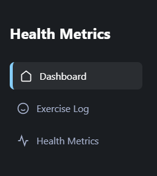

- Implemented health tracking features such as exercise, blood pressure, and blood glucose level logging
  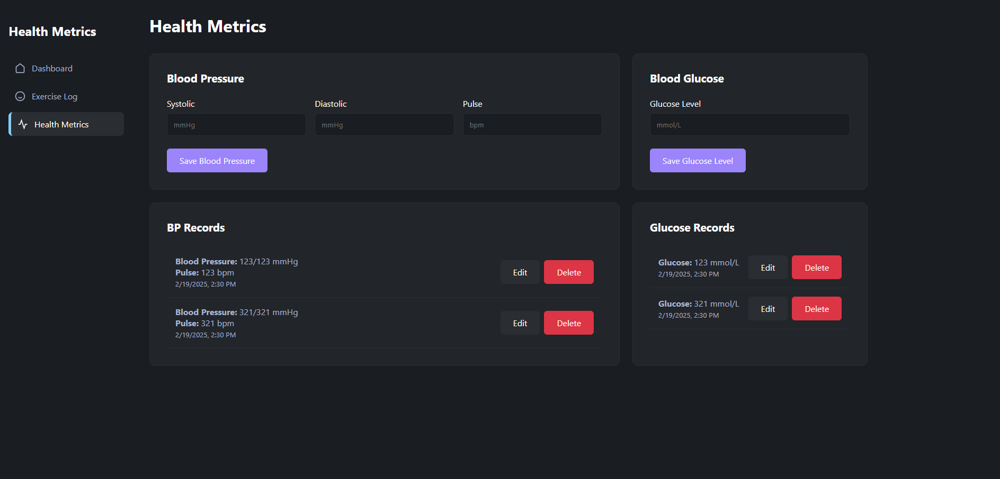 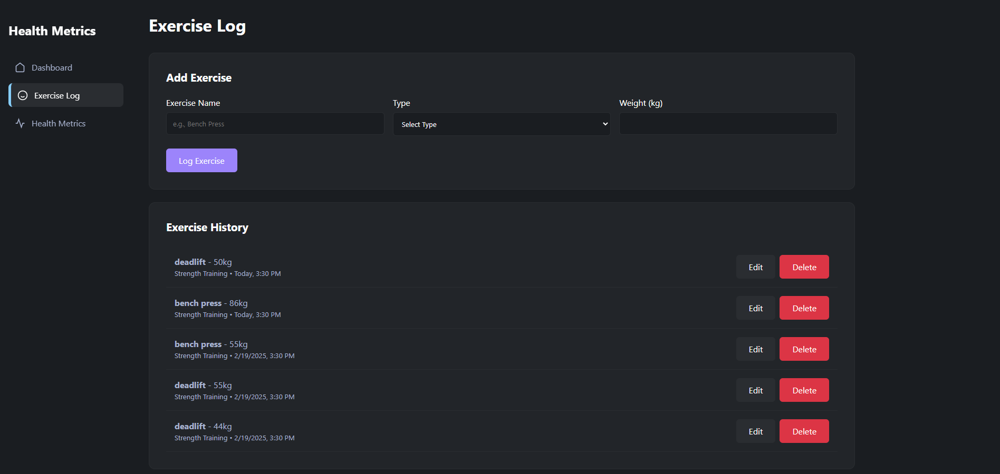

- Created a dashboard page to vizualize exercise and metrics tracking.
  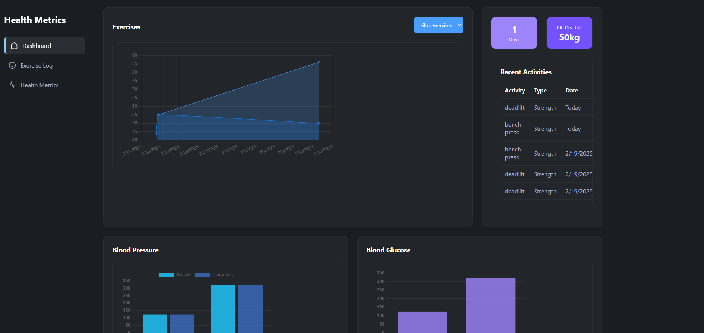
- Improve my data vizualization using Chart.js, here I experimented with line and bar charts to determine the best chart for each category.
- Added engagement features: PR tracking, activity feed, and streak counting.

_Phase 3: Initial Deployment_

- Implemented version control with Git and GitHub as project becomes more complex.
- Deployed my application on Render and learnt about environment configuration.
- Migrated from JSON storage to SQLite database for improved data management.

_Final Phase: CI/CD_

- Implemented user authentication system with signup and login.
  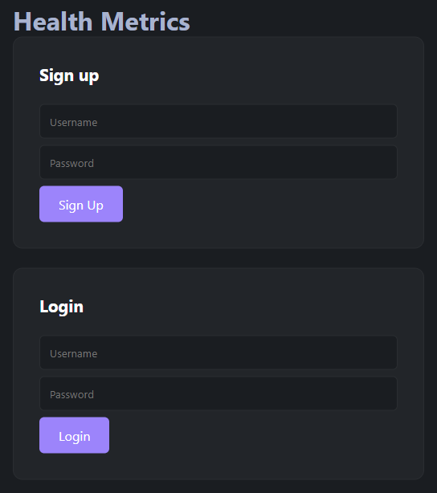
- Updated data model with user associations for the application.
- Refined testing approach using Postman API for backend testing.

## **Problem-Solving:**

One of the first issues I encountered while building my web app was determining the type of data model. I experimented with JavaScript objects and list as I wasn't sure which type of data to start with. Recognizing that my logs would require key and value pairs, I figured that Object data types would be the best.

Secondly, I wasn't very sure how my backend code would work as I am not familiar with backend testing. The testing process was challenging as it require a lot of perserverance and trying to understand my code to solve the problem. I learnt that good error handling and getting familiar with testing APIs will help ease the testing process.

On the frontend side of things, I initially stumble on parsing the right data to my backend. At first, I wasn't entirely sure what are the data that I will be obtaining and how would the parsing process look like. I experimented with my code as well as some trial and error to finally make my frontend code work.

On the design part of my project, I also was having issues with responsiveness. My web app would only work for a laptop sized screen, which can be quite inconvenient. To combat this, I used mediaqueries for my CSS to improve responsiveness.

## Reflections and Lessons Learned

**Key Takeaways:** I have learnt that good planning and architecture is essential in terms of being successful in my project.

Wireframing and thinking about design choices helped me to have a brief idea on what my final product will look like.

On the other hand, data modelling is also key as a first step in planning. having a clear idea of the information required in my product has helped me plan my project better.Also, gave me insight that it should be the most crucial step in most development.

Good error handling and debugging is also crucial to solve any bugs that arise during development.

Having learnt the hard way, in building any project, version control is important in any project.

**Future Improvements:** Here are a bucketlist of updates that I plan to implement:

- [ ] Allowing users to save their favourite exercises or workouts
- [ ] Add a personal touch to the UI by adding "Welcome back 'user'"
- [ ] Improving dashboard visualization
- [ ] Improving responsiveness of my dashboard to allow access in various views

## Conclusion

**Final Thoughts:** I hope that this journey into software development would be a great one. To be very honest, I am terrified but at the same time incredibly excited about growing my passion in innovating and building tools/ applications.
